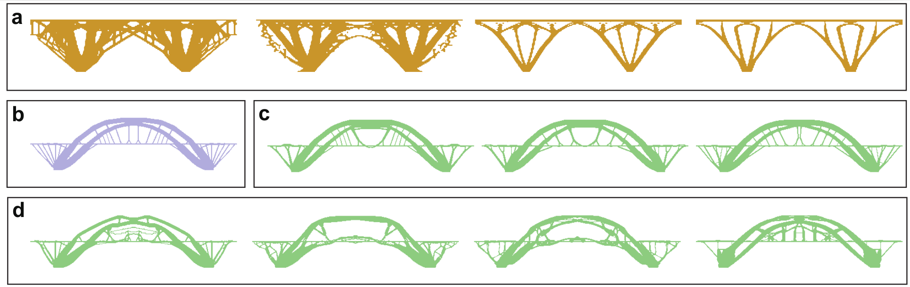
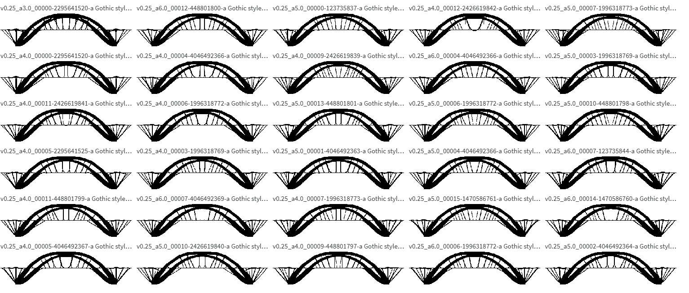

## LMTO
Repository for "*LMTO: Large Model Guided Topology
Optimization for Conceptual Design
Materialization*"

Start from a concept forward to modify or generate structure design with high performance!

## Design Examples 
### 1.Bridges design with different approach


- **a** : LVLM designs with high preferences;
- **b** : TO designs with high performance ;
- **c** : LMTO designs with high performance and preference;
- **d** : LMTO can explore the variety of the joint space;

### 2.Design results overview


All 934 designs under different boundary conditions are
[here](https://wandb.ai/langleo/lmto-GothicBridge/reports/LMTO-for-Gothic-Style-Bridge-Design--VmlldzoxMTM1MDc2MA?accessToken=a8kml1ase4hzxceu35c9kfox1yn169pg7pfge294ku4n9gkj7rq92yvxshyulmfb)
## Update
- [x] 2D LMTO scripts
- [x] ComfyUI node and flow for LMTO

## Inference
Run optimization:
```bash
python scripts/LMTO_wandb.py
```
-  "--nelx": resolution x
-  "--nely": resolution y
-  "--rmin": minimum radius
-  "--bc": boundary condition
-  "--opt_method": optimization method
-  "--alpha": preference weighting
## Explore design space from a given image package
Sweep design domain according to a certain prompt:
```bash
wandb sweep config/sweep_bridgeForceMid.yaml
```

